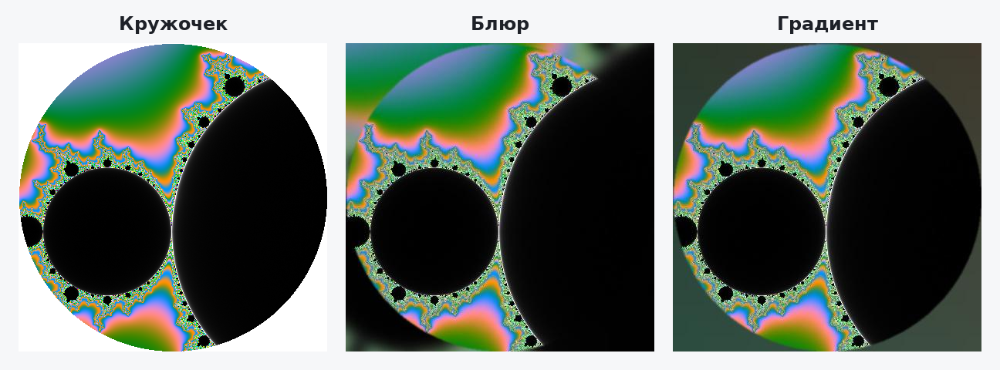

# Circlechek

[Русский](README.md) · **English**

[](https://github.com/EDeev/circlechek/actions/workflows/ci.yml)
[](https://github.com/EDeev/circlechek/actions/workflows/docker.yml)
[](LICENSE)

A Telegram bot for video notes ("circles"): turns a square video into a round video note, and turns a
video note back into a regular video with the corners filled by a blurred frame or a gradient matching
the picture. The bot speaks Russian.

**Status:** personal project, completed · bot [@circlechek_bot](https://t.me/circlechek_bot)



**Stack:** Python 3.12 · aiogram 3 · MoviePy 2 · Pillow · NumPy · Docker

## Features

- **Video → video note.** A square video up to one minute comes back as a circle.
- **Video note → video.** The bot splits the circle into frames, fills the corners and reassembles the
  video with sound. Background options:
  - **blur** — a blurred center of the frame;
  - **gradient** — based on the frame's average color.
- Heavy processing runs in a separate thread, so the bot keeps answering others while one circle is
  processed. Each job gets its own temporary folder, cleaned up even on errors.

> [!NOTE]
> Some Telegram video notes have broken metadata; processing then fails or the video has artifacts. The
> bot warns about this, so check the result.

## Running

```bash
git clone https://github.com/EDeev/circlechek.git && cd circlechek
cp .env.example .env      # BOT_TOKEN from @BotFather
docker compose up -d
```

Prebuilt image: `docker pull ghcr.io/edeev/circlechek` or `docker pull git.deev.su/edeev/circlechek`.

Without Docker: Python 3.12, `pip install -r requirements.txt`, then `cd code && BOT_TOKEN=… python bot.py`
(FFmpeg comes with MoviePy).

## Structure

```
code/bot.py         entry point
code/handlers.py    commands, receiving videos and video notes, background buttons
code/scripts.py     Movie — frames and audio via MoviePy; Frame — background and circle mask via Pillow and NumPy
data/               temporary processing files
```

## Development

```bash
pip install ruff -r requirements.txt
ruff check --select E9,F code
```

CI checks the code on every push and processes test video notes (with and without sound, both
backgrounds). The Docker image is built on `v*` tags and published to GitHub Packages and `git.deev.su`.

## License

MIT — see [LICENSE](LICENSE).

## Author

**Egor Deev** — [GitHub](https://github.com/EDeev) · [Telegram](https://t.me/DeevEgor) · [egor@deev.space](mailto:egor@deev.space)

---

<div align="center">
  <sub>⭐ If you find this project useful, give it a star on GitHub!</sub>
  <p><sub>Made with ❤️ — <a href="https://deev.space">deev.space</a></sub></p>
</div>
